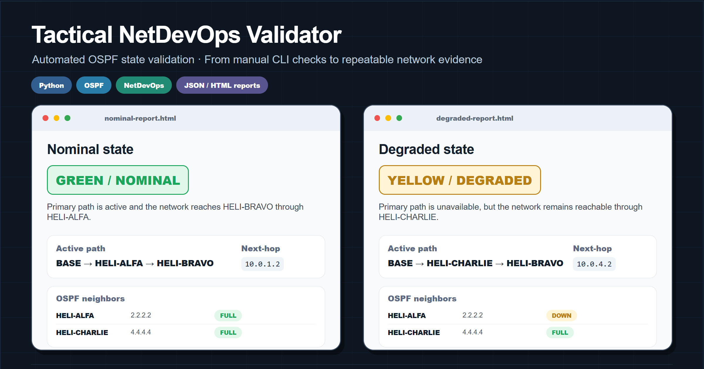

# Tactical NetDevOps Validator

Python-based validator for automated OSPF resilience checks in a tactical IP network lab.

<p align="center">
  
</p>

This project is the automation-focused continuation of the [`tactical-ospf-resilience-lab`](https://github.com/jalbfil/tactical-ospf-resilience-lab) repository.

The first lab validates OSPF resilience manually. This repository adds a NetDevOps-oriented layer: automated evidence collection, parsing, state evaluation and reporting.

---

## 1. Purpose

In a real critical network, an operator should not need to manually run `show ip route`, `show ip ospf neighbor` or `traceroute` on each router every time a link fails.

The goal of this project is to automatically classify the operational state of the lab network as:

| Status | State | Meaning |
|---|---|---|
| `GREEN` | `NOMINAL` | Primary path is active: `BASE -> HELI-ALFA -> HELI-BRAVO` |
| `YELLOW` | `DEGRADED` | Backup path is active: `BASE -> HELI-CHARLIE -> HELI-BRAVO` |
| `RED` | `CRITICAL` | No valid route to the target loopback |
| `INFO` | `ECMP_DETECTED` | Primary and backup paths are both installed as equal-cost routes |

---

## 2. Validated topology

The validator is based on this tactical OSPF lab topology:

```text
BASE -------- HELI-ALFA
 |                |
 |                |
HELI-CHARLIE -- HELI-BRAVO
```

Target node:

```text
HELI-BRAVO loopback: 192.168.3.1/32
```

Expected next-hops from `BASE`:

| Path | Next-hop | Interpretation |
|---|---:|---|
| Primary | `10.0.1.2` | `BASE -> HELI-ALFA -> HELI-BRAVO` |
| Backup | `10.0.4.2` | `BASE -> HELI-CHARLIE -> HELI-BRAVO` |

---

## 3. What the tool does

The validator can work in two modes.

### Offline mode

Reads saved command outputs from `examples/outputs/<scenario>/`.

This mode is useful for:

- developing the parser logic;
- testing the state evaluator;
- running CI without depending on Packet Tracer, GNS3 or live routers;
- documenting expected behavior.

### Live SSH mode

Connects to a device through SSH using Netmiko and collects:

```ios
show ip ospf neighbor
show ip route 192.168.3.1
traceroute 192.168.3.1
```

This mode is intended for GNS3, EVE-NG, Cisco IOSv or real Cisco IOS devices accessible through SSH.

> Packet Tracer may have limitations for external SSH automation depending on version and topology.

---

## 4. Installation

```bash
python -m venv .venv
source .venv/bin/activate  # Linux/macOS
# .venv\Scripts\activate   # Windows PowerShell

pip install -e .[dev]
```

Alternative:

```bash
pip install -r requirements.txt
pip install -e .
```

---

## 5. Run tests

```bash
pytest -q
```

Validated locally:

```text
8 passed
```

See: [`docs/mvp-local-validation.md`](docs/mvp-local-validation.md)

---

## 6. Offline validation examples

### Nominal state

```bash
tactical-validator validate \
  --scenario examples/outputs/nominal \
  --output reports/nominal-report.json \
  --html reports/nominal-report.html
```

Expected result:

```text
GREEN / NOMINAL
```

### Degraded state

```bash
tactical-validator validate \
  --scenario examples/outputs/degraded \
  --output reports/degraded-report.json \
  --html reports/degraded-report.html
```

Expected result:

```text
YELLOW / DEGRADED
```

### Critical state

```bash
tactical-validator validate \
  --scenario examples/outputs/critical \
  --output reports/critical-report.json \
  --html reports/critical-report.html
```

Expected result:

```text
RED / CRITICAL
```

### ECMP detected

```bash
tactical-validator validate \
  --scenario examples/outputs/ecmp \
  --output reports/ecmp-report.json \
  --html reports/ecmp-report.html
```

Expected result:

```text
INFO / ECMP_DETECTED
```

---

## 7. Sample reports

The repository includes generated JSON and HTML reports for the four supported operational states.

| State | JSON report | HTML report | Summary |
|---|---|---|---|
| `GREEN / NOMINAL` | [`nominal-report.json`](reports/nominal-report.json) | [`nominal-report.html`](reports/nominal-report.html) | Primary path active via `HELI-ALFA` |
| `YELLOW / DEGRADED` | [`degraded-report.json`](reports/degraded-report.json) | [`degraded-report.html`](reports/degraded-report.html) | Backup path active via `HELI-CHARLIE` |
| `RED / CRITICAL` | [`critical-report.json`](reports/critical-report.json) | [`critical-report.html`](reports/critical-report.html) | No valid route to `HELI-BRAVO` loopback |
| `INFO / ECMP_DETECTED` | [`ecmp-report.json`](reports/ecmp-report.json) | [`ecmp-report.html`](reports/ecmp-report.html) | Equal-cost primary and backup paths detected |

### Example report outputs

Nominal state:

```json
{
  "status": "GREEN",
  "state": "NOMINAL",
  "active_path": ["BASE", "HELI-ALFA", "HELI-BRAVO"],
  "next_hops": ["10.0.1.2"]
}
```

Degraded state:

```json
{
  "status": "YELLOW",
  "state": "DEGRADED",
  "active_path": ["BASE", "HELI-CHARLIE", "HELI-BRAVO"],
  "next_hops": ["10.0.4.2"]
}
```

Critical state:

```json
{
  "status": "RED",
  "state": "CRITICAL",
  "active_path": null,
  "next_hops": []
}
```

ECMP state:

```json
{
  "status": "INFO",
  "state": "ECMP_DETECTED",
  "next_hops": ["10.0.4.2", "10.0.1.2"]
}
```

---

## 8. Live SSH validation

Copy the environment example:

```bash
cp .env.example .env
```

Edit credentials:

```text
ROUTER_USERNAME=admin
ROUTER_PASSWORD=change_me
```

Prepare an inventory file:

```yaml
devices:
  - name: BASE
    host: 192.168.1.1
    device_type: cisco_ios
```

Run:

```bash
tactical-validator validate-live \
  --inventory examples/inventory.example.yml \
  --output reports/live-report.json \
  --html reports/live-report.html
```

---

## 9. Architecture

```text
CLI
 ├── offline command outputs
 └── live SSH collection
        ↓
parsers
 ├── OSPF neighbors
 ├── IP route
 └── traceroute
        ↓
evaluator
 ├── GREEN / NOMINAL
 ├── YELLOW / DEGRADED
 ├── RED / CRITICAL
 └── INFO / ECMP_DETECTED
        ↓
reporters
 ├── JSON
 └── HTML
```

---

## 10. Repository structure

```text
tactical-netdevops-validator/
├── README.md
├── pyproject.toml
├── requirements.txt
├── .env.example
├── .github/workflows/tests.yml
├── src/tactical_validator/
│   ├── cli.py
│   ├── collector.py
│   ├── evaluator.py
│   ├── inventory.py
│   ├── models.py
│   ├── reporter.py
│   └── parsers/
│       ├── ip_route.py
│       ├── ospf_neighbors.py
│       └── traceroute.py
├── examples/
│   ├── inventory.example.yml
│   └── outputs/
│       ├── nominal/
│       ├── degraded/
│       ├── critical/
│       └── ecmp/
├── reports/
├── tests/
├── docs/
└── linkedin/
```

---

## 11. Professional value

This repository demonstrates:

- Python applied to network validation;
- parsing of operational network evidence;
- automated classification of network state;
- NetDevOps practices applied to a tactical/CIS-inspired lab;
- reporting for validation and troubleshooting;
- transition from manual CLI checks to automated operational assessment.

The practical idea is simple but important:

> In critical communications, it is not enough to know whether a network works. It is necessary to know whether it is operating nominally, degraded, or critically unavailable — and to document that state with evidence.
